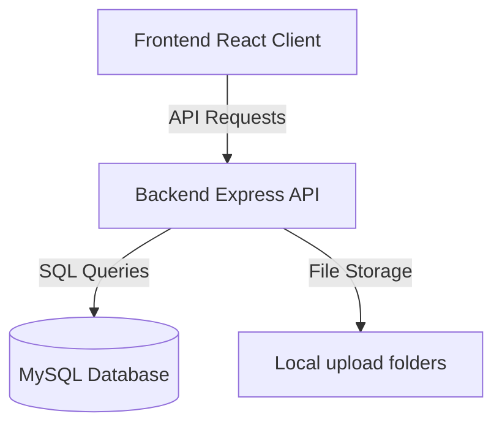
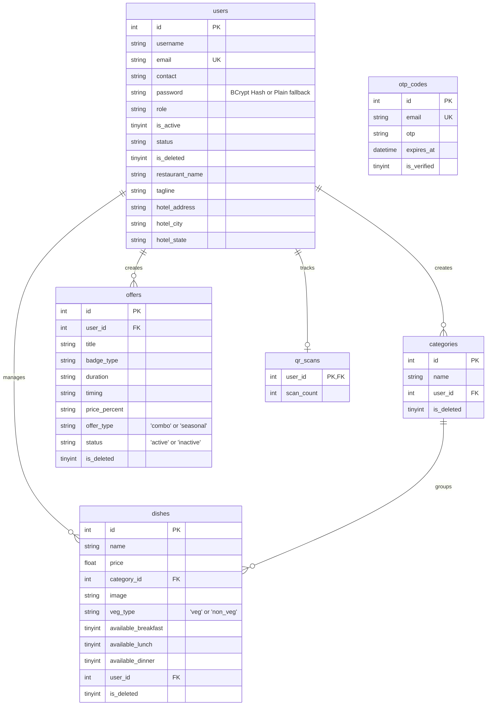

# Vingo - Restaurant Menu Management System

Vingo is a modern, responsive digital QR-code menu and offers management platform designed for restaurants. It allows restaurant owners to create and organize categories and dishes, configure seasonal and combo offers, customize restaurant details, and generate instant, dynamic QR codes that direct customers directly to their public menu.

---

## 🏗️ System Architecture

The project is structured as a decoupled monorepo comprising a backend API and a frontend client application.



### 📂 Directory Structure

```
thevingo/
├── backend/                  # Node.js + Express.js API
│   ├── config/               # Database configurations & connection pool
│   ├── controllers/          # Business logic for auth, menu, and offers
│   ├── middleware/           # Express authentication middleware
│   ├── routes/               # Express API routing tables
│   ├── utils/                # Helper tools (environment, secrets)
│   ├── uploads/              # Stored uploaded image assets (auto-created)
│   ├── app.js                # Core Express application configuration
│   ├── server.js             # Entrypoint file listening on PORT
│   └── package.json          # Dependencies & scripts
└── frontend/                 # React + Vite client app
    ├── public/               # Public assets
    ├── src/
    │   ├── assets/           # Icons and logos
    │   ├── pages/            # Frontend pages & views
    │   │   ├── auth/         # Login, Register, Forgot Password, OTP
    │   │   ├── dashboard/    # Primary analytics dashboard view
    │   │   ├── kitchen-menu/ # Menu configuration pages
    │   │   ├── offers/       # Combos & seasonal campaigns management
    │   │   ├── distribution/ # QR generation & distribution dashboard
    │   │   ├── public-menu/  # Mobile-responsive customer menu view
    │   │   └── settings/     # Restaurant profiles & contact settings
    │   ├── routes/           # Private and public routing shells
    │   ├── utils/            # Helper files (haptics, index)
    │   ├── App.jsx           # Routing & App Shell layout
    │   ├── App.css           # Global shell layout overrides
    │   ├── main.jsx          # React entrypoint
    │   └── index.css         # Modern design tokens & global CSS resets
    ├── package.json          # Dependencies & scripts
    └── vite.config.js        # Vite compiler settings
```

---

## 💾 Database Schema

The backend uses a relational MySQL database. The tables are checked and migrated dynamically at application launch (managed in [authController.js](file:///home/vignesh/github/thevingo/backend/controllers/authController.js)).

### Entity Relationship Model



---

## 🛠️ Tech Stack & Dependencies

### Frontend
- **Framework**: React 19 + Vite 8
- **Routing**: `react-router-dom` v7 (includes `PrivateRoute` and `PublicRoute` wrappers)
- **Utilities**: `qrcode.react` (client-side QR code rendering)
- **Styling**: Modern, responsive CSS with glassmorphism effects, custom scrollbars, and fluid animations.
- **Linting**: Oxlint

### Backend
- **Framework**: Node.js + Express.js v4
- **Database driver**: `mysql2` (Promise-based connection pool)
- **Security**: `bcryptjs` for password hashing, `jsonwebtoken` (JWT) for session management
- **Uploads**: `multer` for multipart form processing & image uploads
- **Mailing**: `nodemailer` with optimized SMTP connection pooling for fast OTP delivery

---

## 🔌 API Documentation

All API routes are prefixed with `/api`. Protected routes require a Bearer token in the `Authorization` header: `Authorization: Bearer <JWT_TOKEN>`.

### Authentication (`/api/auth`)
- `POST /login` - Log in a user. Returns JWT and user payload.
- `POST /register` - Register a new user.
- `POST /check-email` - Check if an email is already registered.
- `POST /send-otp` - Send verification OTP to an email address.
- `POST /verify-otp` - Verify the emailed OTP.
- `POST /reset-password` - Reset account password.
- `GET /profile` (Protected) - Fetch current user profile.
- `PUT /settings` (Protected) - Update restaurant settings and contact details.
- `GET /dashboard` (Protected) - Fetch menu statistics & scan metrics.
- `POST /logout` - Clear active user sessions.

### Menu Management (`/api/menu`)
- `GET /public/:slug` - Fetch public restaurant profile, categories, dishes, and active offers (No auth required).
- `GET /categories` (Protected) - Fetch categories and their constituent dishes for the logged-in user.
- `POST /categories` (Protected) - Create a new menu category.
- `POST /dishes` (Protected, Multipart form) - Add a new dish with an optional image upload.
- `DELETE /categories/:id` (Protected) - Mark a category as deleted.
- `POST /dishes/delete-batch` (Protected) - Delete multiple dishes.

### Offers Management (`/api/offers`)
- `GET /` (Protected) - Fetch all promotional offers.
- `POST /` (Protected) - Create a new combo or seasonal promotion.
- `PUT /:id/toggle` (Protected) - Toggle active/inactive status of an offer.
- `POST /delete-batch` (Protected) - Delete multiple offers in one request.

---

## 🚀 Setup & Execution Guide

### Prerequisite Environment Variables

Create a `.env` file in the `backend/` directory:

```env
PORT=5000
DB_HOST=localhost
DB_USER=your_mysql_username
DB_PASSWORD=your_mysql_password
DB_NAME=thevingo_db
DB_PORT=3306

JWT_SECRET=your_jwt_signature_key
JWT_EXPIRY=24h

# SMTP Config for OTP emails
SMTP_HOST=smtp.mailtrap.io
SMTP_PORT=2525
SMTP_SECURE=false
SMTP_USER=smtp_username
SMTP_PASS=smtp_password
PURCHASE_SMTP_USER=welcome_smtp_username
PURCHASE_SMTP_PASS=welcome_smtp_password
```

Create a `.env` file in the `frontend/` directory (optional, defaults to standard local development values):

```env
VITE_API_URL=http://localhost:5000
VITE_APP_URL=http://localhost:5173
```

---

### Setup Instructions

1. **Database Setup**
   Ensure MySQL server is running and create the empty database specified in your backend `.env` (`thevingo_db`). The backend server initializes the tables automatically on start.

2. **Run Backend**
   ```bash
   cd backend
   npm install
   npm run dev
   ```

3. **Run Frontend**
   ```bash
   cd frontend
   npm install
   npm run dev
   ```

---

## 🤖 Guidance for Developers & AI agents

- **Database Alterations**: Table column configurations are updated dynamically inside `backend/controllers/authController.js` on startup. If adding new fields, add matching `ALTER TABLE` queries to the self-executing schema function in `authController.js` to ensure they migrate correctly on all developers' local instances.
- **Route Guarding**: Restrict views using `<PrivateRoute>` and `<PublicRoute>` components in `frontend/src/routes/`.
- **Global Styling**: Tailwind is not used. Standard CSS tokens (fonts, colors, background styles, animations) are detailed in [index.css](file:///home/vignesh/github/thevingo/frontend/src/index.css) and should be reused to maintain visual consistency.
- **Haptic Feedback**: The frontend utilizes a haptic vibration wrapper helper at [haptics.js](file:///home/vignesh/github/thevingo/frontend/src/utils/haptics.js) for mobile device events. Apply it for critical interactions when building mobile views.
